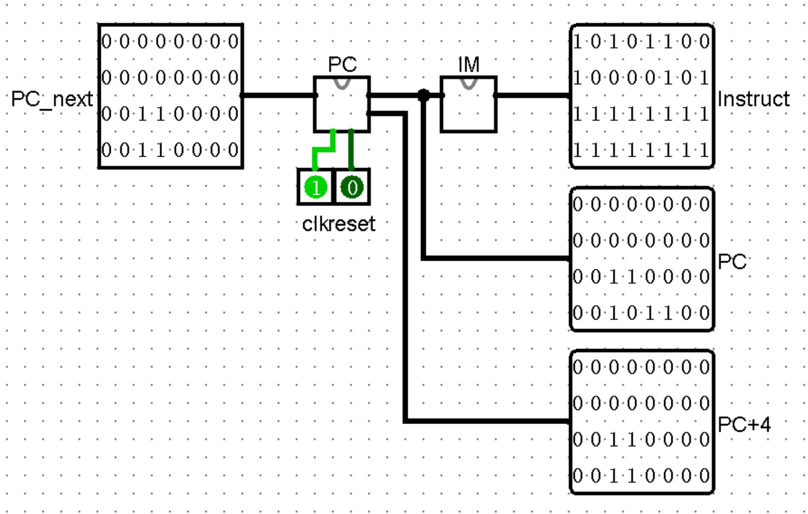
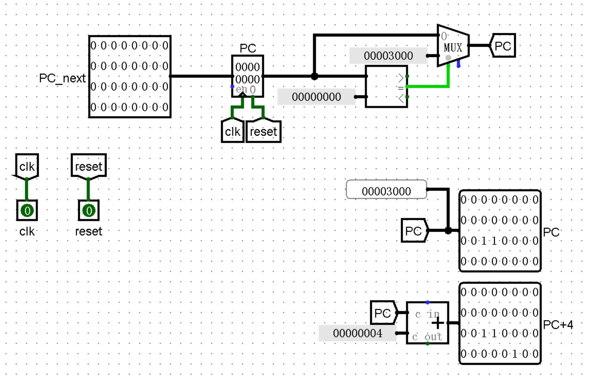
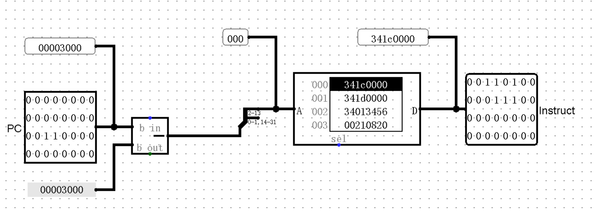
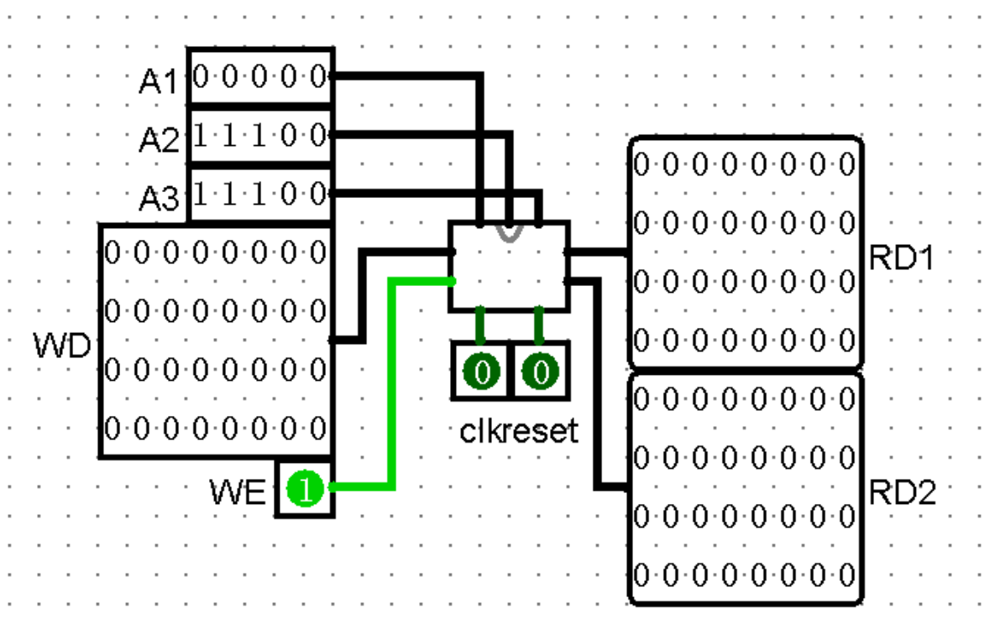
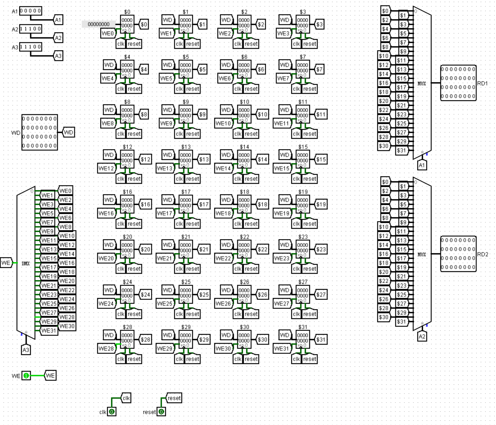
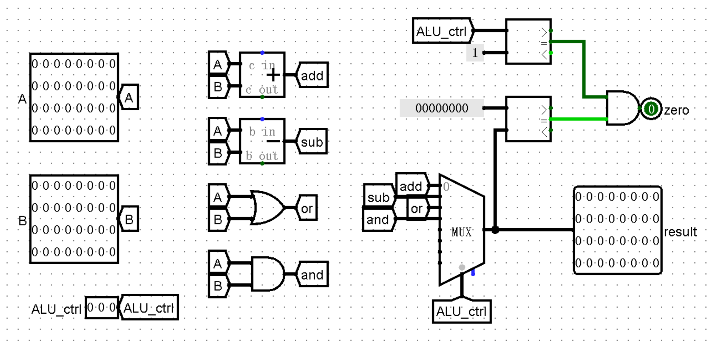
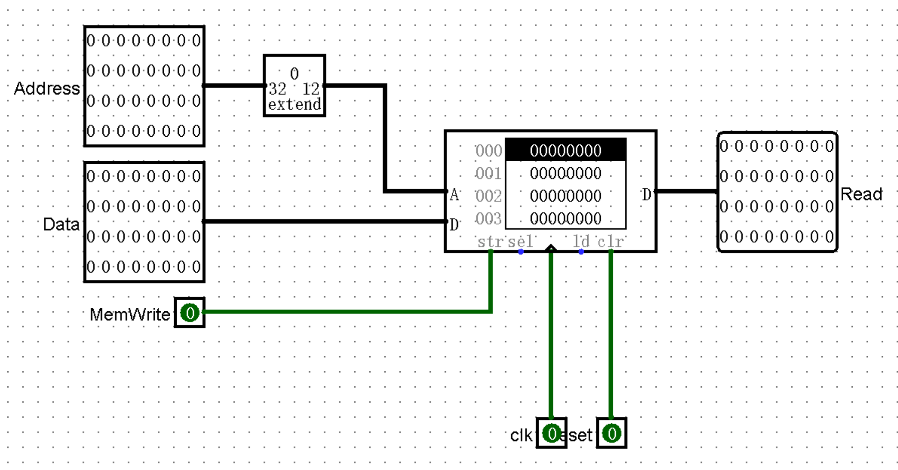
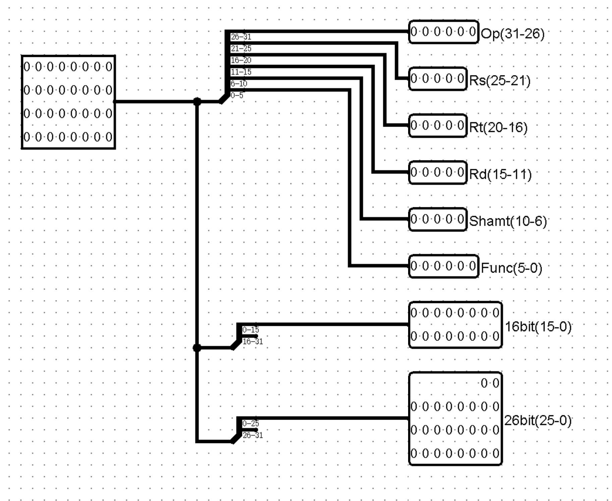
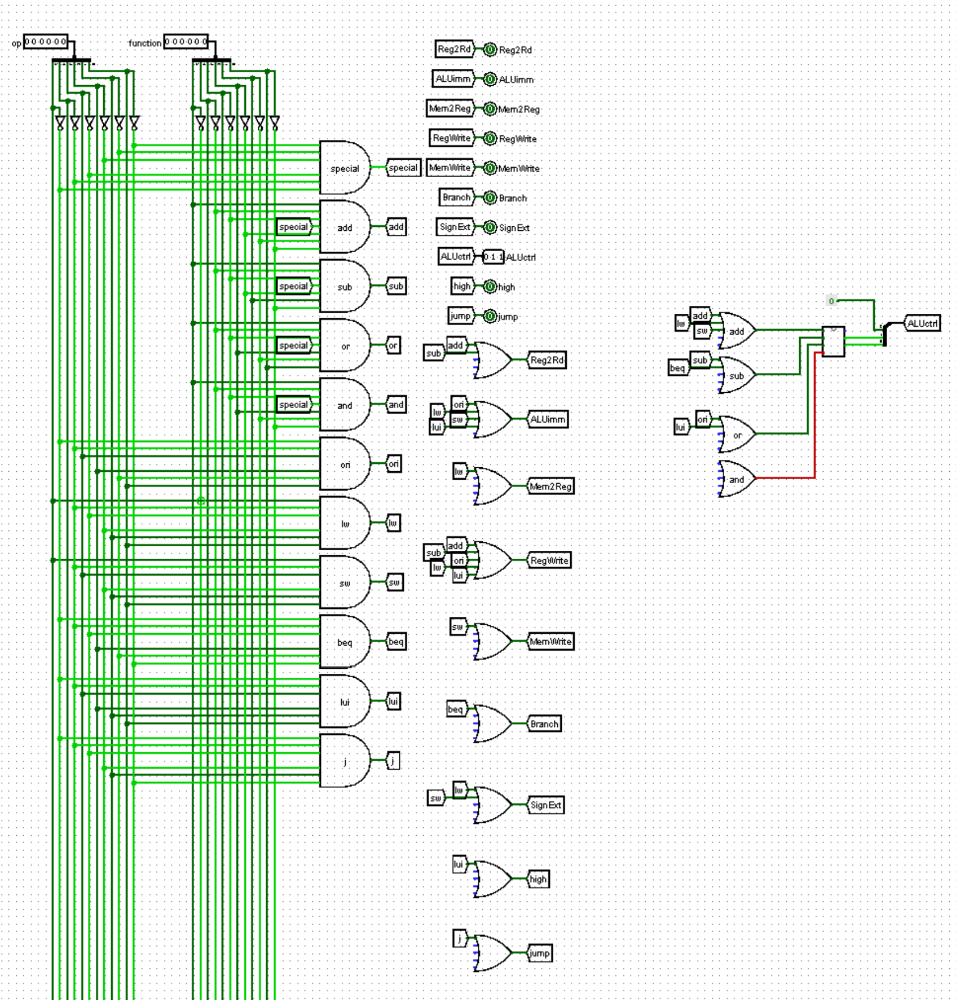
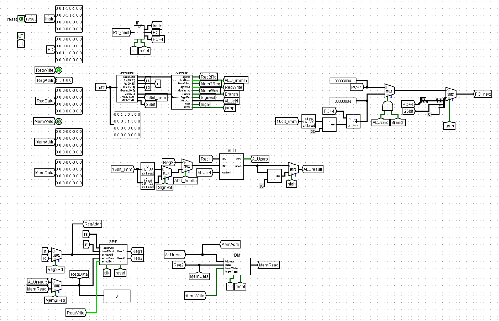

# 计算机组成 P3 - Logisim Single Cycle CPU

::github{repo="Alkaid-Zhong/BUAA-CO-2023"}

##  IFU

|   port   |   mode    |             function              |
| :------: | :-------: | :-------------------------------: |
| PC_next  | in[31:0]  | 32bit address of PC in next cycle |
| Instruct | out[31:0] |             Instruct              |
|    PC    | out[31:0] |                PC                 |
|   PC+4   | out[31:0] |               PC+4                |



### PC

- Addresses: **0x00003000 - 0x00006FFF**
- reset mode: **asynchronous reset**
  - reset address to **0x00003000**


|  port   |   mode    |             function              |
| :-----: | :-------: | :-------------------------------: |
| PC_next | in[31:0]  | 32bit address of PC in next cycle |
|   PC    | out[31:0] |                PC                 |
|  PC+4   | out[31:0] |               PC+4                |



### IM

- ROM

  - 4096 x 32bit
  - use PC[13:2] as address

|   port   |   mode    | function |
| :------: | :-------: | :------: |
|    PC    | in[31:0]  |    PC    |
| Instruct | out[31:0] | Instruct |



## GRF

```
RD1 <- GPR[A1]
RD2 <- GPR[A2]
if WE then GPR[A3] <- WD (at posedge)
```
- reset mode: **asynchronous reset**

| port  |   mode    |      function      |
| :---: | :-------: | :----------------: |
|  A1   |  in[4:0]  |  address of read1  |
|  A2   |  in[4:0]  |  address of read2  |
|  A3   |  in[4:0]  |  address of write  |
|  WD   | in[31:0]  |    data source     |
|  WE   |    in     |    write enable    |
|  clk  |    in     |   clock(posedge)   |
| reset |    in     | asynchronous reset |
|  RD1  | out[31:0] |     data of A1     |
|  RD2  | out[31:0] |     data of A2     |



### Register Set



## ALU

|   port   |   mode    |                           function                           |
| :------: | :-------: | :----------------------------------------------------------: |
|    A     | in[31:0]  |                           input A                            |
|    B     | in[31:0]  |                           input B                            |
| ALU_ctrl |  in[2:0]  | 000: result = A + B<br />001: result = A - B<br />010: result = A \| B<br />011: result = A & B |
|  result  | out[31:0] |                            result                            |
|   zero   |    out    |                    set 1 when result = 0                     |



## DM

- RAM
  - 3072 x 32bit
  - use Address[11:0] as address

|   port   |   mode    |         function         |
| :------: | :-------: | :----------------------: |
| Address  | in[31:0]  |         address          |
|   Data   | in[31:0]  |        write data        |
| MemWrite |    in     | write data to RAM when 1 |
|   clk    |    in     |      clock(posedge)      |
|  reset   |    in     |    asynchronous reset    |
|   Read   | out[31:0] | data of memory[Address]  |



InstrSplitter

function: split instruct into different code

|   op    |   rs    |   rt    |   rd    | Shamt  | func  | 16bitImm | 26bit  |
| :-----: | :-----: | :-----: | :-----: | :----: | :---: | :------: | :----: |
| [31:26] | [25:21] | [20:16] | [15:11] | [10:6] | [5:0] |  [16:0]  | [25:0] |



## Controller

input: **op** and **function**

|   port   |  mode   |         function          |
| :------: | :-----: | :-----------------------: |
|    op    | in[5:0] |   op of instruct[31:26]   |
| function | in[5:0] | function of instruct[5:0] |

output:

|   port   |                           function                           |
| :------: | :----------------------------------------------------------: |
|  Reg2Rd  |    0: write data to GPR[rt]<br />1: write data to GPR[rd]    |
|  ALUimm  |  0: ALU use GPR[rt] as inB<br />1: ALU use 16bitImm as inB   |
| Mem2Reg  | 0: write ALUresult to register<br />1: write memory data to register |
| RegWrite | 0: write data to register<br />1: write to register disable  |
| MemWrite |   0: write data to memory<br />1: write to memory disable    |
|  Branch  |                     1: branch operation                      |
| SignExt  |     0: zero extend 16bitImm<br />1: sign extend 16bitImm     |
| ALUctrl  | 000: result = A + B<br />001: result = A - B<br />010: result = A \| B |
|   high   | 0: set ALU result into [15:0]<br />1: set ALU result into [31:16] |
|   jump   |                      1: jump operation                       |

Control Signals - Instruct table

|  op  |       Reg2Rd       |       ALUimm       |      Mem2Reg       |      RegWrite      |      MemWrite      |       Branch       |      SignExt       | ALUctrl |        high        |        jump        |
| :--: | :----------------: | :----------------: | :----------------: | :----------------: | :----------------: | :----------------: | :----------------: | :-----: | :----------------: | :----------------: |
| add  | :white_check_mark: |                    |                    | :white_check_mark: |                    |                    |                    | **add** |                    |                    |
| sub  | :white_check_mark: |                    |                    | :white_check_mark: |                    |                    |                    | **sub** |                    |                    |
| ori  |                    | :white_check_mark: |                    | :white_check_mark: |                    |                    |                    | **or**  |                    |                    |
|  lw  |                    | :white_check_mark: | :white_check_mark: | :white_check_mark: |                    |                    | :white_check_mark: | **add** |                    |                    |
|  sw  |                    | :white_check_mark: |                    |                    | :white_check_mark: |                    | :white_check_mark: | **add** |                    |                    |
| beq  |                    |                    |                    |                    |                    | :white_check_mark: |                    | **sub** |                    |                    |
| lui  |                    | :white_check_mark: |                    | :white_check_mark: |                    |                    |                    | **or**  | :white_check_mark: |                    |
| nop  |                    |                    |                    |                    |                    |                    |                    |         |                    |                    |
|  j   |                    |                    |                    |                    |                    |                    |                    |         |                    | :white_check_mark: |



## main

### R format

```
add:
	GPR[rd] <- GPR[rs] + GPR[rt]
sub:
	GPR[rd] <- GPR[rs] - GPR[rt]
```

| instruct | special |   rs    |   rt    |   rd    | shamt  |  func  |
| :------: | :-----: | :-----: | :-----: | :-----: | :----: | :----: |
|          | [31:26] | [25:21] | [20:16] | [15:11] | [10:6] | [5:0]  |
|   add    | 000000  |         |         |         | 00000  | 100000 |
|   sub    | 000000  |         |         |         | 00000  | 100010 |

### I format

```
ori:
	 GPR[rt] <- GPR[rs] OR zero_extend(immediate)
lw:
	 GPR[rt] <- memory[GPR[rs]+sign_extend(immediate)]
sw:
	memory[GPR[rs]+sign_extend(immediate)] <- GPR[rt]
beq:
	if (GPR[rs] == GPR[rt])
		PC <- PC + 4 + sign_extend(immediate<<2)
	else 
		PC <- PC + 4
lui:
	GPR[rt] <- immediate << 16
```

| instruct |   op    |   rs    |   rt    | immediate |
| :------: | :-----: | :-----: | :-----: | :-------: |
|          | [31:26] | [25:21] | [20:16] |  [15:0]   |
|   ori    | 001101  |         |         |           |
|    lw    | 100011  |         |         |           |
|    sw    | 101011  |         |         |           |
|   beq    | 000100  |         |         |           |
|   lui    | 001111  |         |         |           |



# 思考题

1. 上面我们介绍了通过 FSM 理解单周期 CPU 的基本方法。请大家指出单周期 CPU 所用到的模块中，哪些发挥状态存储功能，哪些发挥状态转移功能。

   存储功能：IM, GRF, DM

   状态转移：IFU(PC)(状态存储), ALU(状态转移)

2. 现在我们的模块中 IM 使用 ROM， DM 使用 RAM， GRF 使用 Register，这种做法合理吗？ 请给出分析，若有改进意见也请一并给出。

   IM只需要被读取，其中的值不会被修改，使用ROM合理

   DM需要实现读取和写入，因此使用RAM和Register都是合理的，但是由于DM有3072的空间，并且一次只会被读取一个数，使用寄存器太浪费了。

   GRF需要被频繁读写，因此使用Register是合理的

3. 在上述提示的模块之外，你是否在实际实现时设计了其他的模块？如果是的话，请给出介绍和设计的思路。

   还实现了InstructSplitter, 上文有介绍

4. 事实上，实现 `nop` 空指令，我们并不需要将它加入控制信号真值表，为什么？

   因为nop指令会被识别成R型指令，rs, rt, rd均为0号寄存器，这个寄存器的值恒为0，因此不需要特殊处理

5. 阅读 Pre 的“MIPS 指令集及汇编语言”一节中给出的测试样例，评价其强度（可从各个指令的覆盖情况，单一指令各种行为的覆盖情况等方面分析），并指出具体的不足之处。

   sw和lw指令没有覆盖offset为负数的情况

   没有测试nop和sub指令
