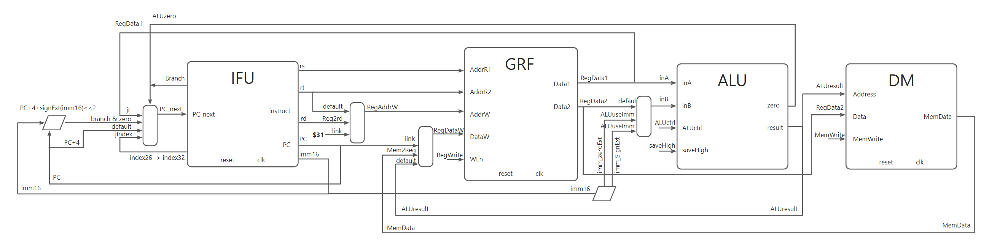

# 计算机组成 P4 - Verilog Single Cycle CPU

::github{repo="Alkaid-Zhong/BUAA-CO-2023"}

## Supported instruction set

`add, sub, ori, lw, sw, beq, lui, jal, jr, nop`

## Data Path



### PC_next

```
Branch & ALUzero:
	PC_next <- PC + 4 + signExt(imm16) << 2
Jump to index: # jIndex
	PC_next <- {PC[31:28], index26,  2'b00}
Jump to register: # jr
	PC_next <- GPR[31]
(deafult):
	PC_next <- PC + 4
```

### RegAddr

```
Jump and link $ra: # link
	RegAddrW <- 31
Write to rd: # RegW2rd
	RegAddrW <- rd
(default) Write to rt:
	RegAddrW <- rt
```

### RegDataW

```
load memory to register: # Mem2Reg
	RegDataW <- MemData
Jump and link $ra: # link
	RegDataW <- PC + 4
(default):
	RegDataW <= ALUresult
```

### ALU data within

```
Use 16bit imm: # ALUuseImm
	need signExt: #immSignExt
		inB <- signExt(imm16)
	(default) zeroExt:
		inB <- zeroExt(imm16)
(default) Use GRF[RegAddr2]:
```


## Controller

<table style="text-align:center; font-size:10px">
    <tr>
        <th>op</th>
        <th colspan="4">Regitser</th>
        <th colspan="4">ALU</th>
        <th>Memory</th>
        <th colspan="3">PC</th>
    </tr>
    <tr>
        <td style="font-weight: bold;"></td>
        <td>RegW2rd</td>
        <td>Mem2Reg</td>
        <td>link</td>
        <td>RegWrite</td>
        <td>ALUuseImm</td>
        <td>immSignExt</td>
        <td>ALUctrl</td>
        <td>saveHigh</td>
        <td>MemWrite</td>
        <td>Branch</td>
        <td>jIndex</td>
        <td>jr</td>
    </tr>>
    <tr>
        <td style="font-weight: bold;">add</td>
        <td>&#10004</td>
        <td></td>
        <td></td>
        <td>&#10004</td>
        <td></td>
        <td></td>
        <td style="font-weight: bold;">add</td>
        <td></td>
        <td></td>
        <td></td>
        <td></td>
        <td></td>
    </tr>
    <tr>
        <td style="font-weight: bold;">sub</td>
        <td>&#10004</td>
        <td></td>
        <td></td>
        <td>&#10004</td>
        <td></td>
        <td></td>
        <td style="font-weight: bold;">sub</td>
        <td></td>
        <td></td>
        <td></td>
        <td></td>
        <td></td>
    </tr>
    <tr>
        <td style="font-weight: bold;">ori</td><!--op-->
        <td></td><!--RegW2rd-->
        <td></td><!--Mem2Reg-->
        <td></td><!--link-->
        <td>&#10004</td><!--RegWrite-->
        <td>&#10004</td><!--ALUuseImm-->
        <td></td><!--immSignExt-->
        <td style="font-weight: bold;">or</td><!--ALUctrl-->
        <td></td><!--saveHigh-->
        <td></td><!--MemWrite-->
        <td></td><!--Branch-->
        <td></td><!--jIndex-->
        <td></td><!--jr-->
    </tr>
    <tr>
        <td style="font-weight: bold;">lw</td><!--op-->
        <td></td><!--RegW2rd-->
        <td>&#10004</td><!--Mem2Reg-->
        <td></td><!--link-->
        <td>&#10004</td><!--RegWrite-->
        <td>&#10004</td><!--ALUuseImm-->
        <td>&#10004</td><!--immSignExt-->
        <td style="font-weight: bold;">add</td><!--ALUctrl-->
        <td></td><!--saveHigh-->
        <td></td><!--MemWrite-->
        <td></td><!--Branch-->
        <td></td><!--jIndex-->
        <td></td><!--jr-->
    </tr>
    <tr>
        <td style="font-weight: bold;">sw</td><!--op-->
        <td></td><!--RegW2rd-->
        <td></td><!--Mem2Reg-->
        <td></td><!--link-->
        <td></td><!--RegWrite-->
        <td>&#10004</td><!--ALUuseImm-->
        <td>&#10004</td><!--immSignExt-->
        <td style="font-weight: bold;">add</td><!--ALUctrl-->
        <td></td><!--saveHigh-->
        <td>&#10004</td><!--MemWrite-->
        <td></td><!--Branch-->
        <td></td><!--jIndex-->
        <td></td><!--jr-->
    </tr>
    <tr>
        <td style="font-weight: bold;">beq</td><!--op-->
        <td></td><!--RegW2rd-->
        <td></td><!--Mem2Reg-->
        <td></td><!--link-->
        <td></td><!--RegWrite-->
        <td></td><!--ALUuseImm-->
        <td></td><!--immSignExt-->
        <td style="font-weight: bold;">sub</td><!--ALUctrl-->
        <td></td><!--saveHigh-->
        <td></td><!--MemWrite-->
        <td>&#10004</td><!--Branch-->
        <td></td><!--jIndex-->
        <td></td><!--jr-->
    </tr>
    <tr>
        <td style="font-weight: bold;">lui</td><!--op-->
        <td></td><!--RegW2rd-->
        <td></td><!--Mem2Reg-->
        <td></td><!--link-->
        <td>&#10004</td><!--RegWrite-->
        <td>&#10004</td><!--ALUuseImm-->
        <td></td><!--immSignExt-->
        <td style="font-weight: bold;">or</td><!--ALUctrl-->
        <td>&#10004</td><!--saveHigh-->
        <td></td><!--MemWrite-->
        <td></td><!--Branch-->
        <td></td><!--jIndex-->
        <td></td><!--jr-->
    </tr>
    <tr>
        <td style="font-weight: bold;">jal</td><!--op-->
        <td></td><!--RegW2rd-->
        <td></td><!--Mem2Reg-->
        <td>&#10004</td><!--link-->
        <td>&#10004</td><!--RegWrite-->
        <td></td><!--ALUuseImm-->
        <td></td><!--immSignExt-->
        <td style="font-weight: bold;">nop</td><!--ALUctrl-->
        <td></td><!--saveHigh-->
        <td></td><!--MemWrite-->
        <td></td><!--Branch-->
        <td>&#10004</td><!--jIndex-->
        <td></td><!--jr-->
    </tr>
    <tr>
        <td style="font-weight: bold;">jr</td><!--op-->
        <td></td><!--RegW2rd-->
        <td></td><!--Mem2Reg-->
        <td></td><!--link-->
        <td></td><!--RegWrite-->
        <td></td><!--ALUuseImm-->
        <td></td><!--immSignExt-->
        <td style="font-weight: bold;">nop</td><!--ALUctrl-->
        <td></td><!--saveHigh-->
        <td></td><!--MemWrite-->
        <td></td><!--Branch-->
        <td></td><!--jIndex-->
        <td>&#10004</td><!--jr-->
    </tr>
    <tr>
        <td style="font-weight: bold;"></td><!--op-->
        <td></td><!--RegW2rd-->
        <td></td><!--Mem2Reg-->
        <td></td><!--link-->
        <td></td><!--RegWrite-->
        <td></td><!--ALUuseImm-->
        <td></td><!--immSignExt-->
        <td style="font-weight: bold;"></td><!--ALUctrl-->
        <td></td><!--saveHigh-->
        <td></td><!--MemWrite-->
        <td></td><!--Branch-->
        <td></td><!--jIndex-->
        <td></td><!--jr-->
    </tr>
</table>


## GRF

```
DataR1 <- GPR[AddrR1]
DataR2 <- GPR[AddrR2]
when posedge clk:
    if reset:
        GPR[0] <- 0x0000_0000
        ...
        GPR[31] <- 0x0000_0000	
	else if WEn:
		GPR[AddrW] <- DataW
		$display
```

### Inputs

|   port   |   bit    |
| :------: | :------: |
| `AddrR1` | `[4:0]`  |
| `AddrR2` | `[4:0]`  |
| `AddrW`  | `[4:0]`  |
| `DataW`  | `[31:0]` |
|  `WEn`   |   `1`    |
|  `clk`   |   `1`    |
| `reset`  |   `1`    |
|  `WPC`   | `[31:0]` |

### Outputs

|   port   |   bit    |
| :------: | :------: |
| `DataR1` | `[31:0]` |
| `DataR2` | `[31:0]` |

## ALU

```
if saveHigh
	result <- (inA op inB) << 16
else
	result <- inA op inB
zero <- result == 0
```

### Inputs

|    port    |   bit    |
| :--------: | :------: |
|   `inA`    | `[31:0]` |
|   `inB`    | `[31:0]` |
| `ALUctrl`  | `[2:0]`  |
| `saveHigh` |   `1`    |

### Outputs

|   port   |   bit    |
| :------: | :------: |
|  `zero`  |   `1`    |
| `result` | `[31:0]` |

## IFU

```
instruct <- instruct_memory[PC]
PC <- PC_next
```

### Inputs

|   port    |   bit    |
| :-------: | :------: |
| `PC_next` | `[31:0]` |
|   `clk`   |   `1`    |
|  `reset`  |   `1`    |

### Outputs

|    port    |   bit    |
| :--------: | :------: |
| `instruct` | `[31:0]` |
|    `PC`    | `[31:0]` |

### *IM

```
instruct <- ROM[PC]
```

#### Memory

__ROM: 4096 x 32bit__

#### Inputs

| port |   bit    |
| :--: | :------: |
| `PC` | `[31:0]` |

#### Outputs

|    port    |   bit    |
| :--------: | :------: |
| `instruct` | `[31:0]` |

## DM

```
MemData <- memory[Address]
when posedge clk:
	if MemWrite:
		memory[Address] <- Data
```

### Inputs

|    port    |    bit     |
| :--------: | :--------: |
| `Address`  |  `[31:0]`  |
|   `Data`   | ``[31:0]`` |
| `MemWrite` |    `1`     |
|   `clk`    |    `1`     |
|  `reset`   |    `1`     |
|   `WPC`    |  `[31:0]`  |

### Outputs

|   port    |   bit    |
| :-------: | :------: |
| `MemData` | `[31:0]` |

## Instruct Translator (Debug)

__这个模块仅用于在debug的时候将16进制机器码翻译为汇编代码__

__输出格式为：__` at ins: 0x0cadfc00 0x00003000: add $1, $2, $3`

```verilog
if(op == `special) begin
    if(func == `add)
        $display("at ins: %h: @%h: add $%d, $%d, $%d", instruct, PC, rd, rs, rt);
    else if(func == `sub)
        $display("at ins: %h: @%h: sub $%d, $%d, $%d", instruct, PC, rd, rs, rt);
    else if(func == `jr)
        $display("at ins: %h: @%h: jr $%d", instruct, PC, rs);
end
else begin
    if(op == `ori)
        $display("at ins: %h: @%h: ori $%d, $%d, %h", instruct, PC, rt, rs, imm16_zeroExt);
    else if (op == `lw)
        $display("at ins: %h: @%h: lw $%d, %h($%d)", instruct, PC, rt, imm16_signExt, rs);
    else if (op == `sw)
        $display("at ins: %h: @%h: sw $%d, %h($%d)", instruct, PC, rt, imm16_signExt, rs);
    else if (op == `beq)
        $display("at ins: %h: @%h: beq $%d, $%d, %h -> %h", instruct, PC, rs, rt, imm16_signExt, PC + 4 + (imm16_signExt << 2));
    else if (op == `lui)
        $display("at ins: %h: @%h: lui $%d, %h", instruct, PC, rt, imm16_zeroExt);
    else if (op == `jal)
        $display("at ins: %h: @%h: jal %h -> %h", instruct, PC, index26, index32);
end
```

## 思考题

1. 阅读下面给出的 DM 的输入示例中（示例 DM 容量为 4KB，即 32bit × 1024字），根据你的理解回答，这个 addr 信号又是从哪里来的？地址信号 addr 位数为什么是 [11:2] 而不是 [9:0] ？

   A：因为DM一共有1024字，即10bit地址位，addr的范围为`0x00000000-0x00002FFF`，实际使用的因为是按字寻址，因此addr必然是4的倍数，只需用到`addr[11:2]`这几位的数字，后两位是`00`

2. 思考上述两种控制器设计的译码方式，给出代码示例，并尝试对比各方式的优劣。

   **控制信号每种取值所对应的指令**

   ```verilog
   assign RegWrite = (op == `special ||
                       op == `ori ||
                       op == `lw ||
                       op == `lui ||
                       op == `jal);
   ```
   优势：

   - 简洁（易于实现和维护，添加指令的时候只需要加入对应控制信号的表即可）

   - 可以清晰地了解每个指令需要的操作，这有助于提高代码的可读性

   劣势：

   - 加入新的指令的时候会修改所有的控制信号表

   **指令对应的控制信号如何取值**

   ```verilog
   if (op == 6'b000000) begin
       if (func == 6'b100000) begin        // add
           RegDst = 1'b1;
           ALUsrc = 1'b0;
           ALUop = 2'b00;
           PCsrc = 1'b0;
           ReadData = 1'b0; // x
           WriteData = 1'b0; // x
           MemToReg = 1'b1;
           ShfToReg = 1'b0;
           RegWrite = 1'b1;
           ExtRes = 1'b0; // x
           Jump = 2'b00;
       end
       else if (func == 6'b100010) begin   // sub
           RegDst = 1'b1;
           ALUsrc = 1'b0;
           ALUop = 2'b01;
           PCsrc = 1'b0;
           ReadData = 1'b0; // x
           WriteData = 1'b0; // x
           MemToReg = 1'b1;
           ShfToReg = 1'b0;
           RegWrite = 1'b1;
           ExtRes = 1'b0; // x
           Jump = 2'b0;
   	end
   end
   ```
   优势：

   - 可以灵活修改指令的控制信号

   劣势：

   - 可能需要更多的逻辑，会增加设计的复杂性。

3. 在相应的部件中，复位信号的设计都是**同步复位**，这与 P3 中的设计要求不同。请对比**同步复位**与**异步复位**这两种方式的 reset 信号与 clk 信号优先级的关系。

   **同步复位**

   clk优先级大于reset

   **异步复位**

   reset优先级大于clk

4. C 语言是一种弱类型程序设计语言。C 语言中不对计算结果溢出进行处理，这意味着 C 语言要求程序员必须很清楚计算结果是否会导致溢出。因此，如果仅仅支持 C 语言，MIPS 指令的所有计算指令均可以忽略溢出。 请说明为什么在忽略溢出的前提下，addi 与 addiu 是等价的，add 与 addu 是等价的。提示：阅读《MIPS32® Architecture For Programmers Volume II: The MIPS32® Instruction Set》中相关指令的 Operation 部分。

   ```pascal
   temp ← (GPR[rs]31||GPR[rs]31..0) + (GPR[rt]31||GPR[rt]31..0)
   if temp32 ≠ temp31 then
   	SignalException(IntegerOverflow)
   else
   	GPR[rd] ← temp
   endif
   ```

   在忽略溢出的情况下，这段代码可以直接改写为

   ```
   temp ← (GPR[rs]31||GPR[rs]31..0) + (GPR[rt]31||GPR[rt]31..0)
   GPR[rd] ← temp
   ```

   又由于寄存器的位宽为32，因此33位的数据被舍弃，代码可以改为写

   ```
   emp ← GPR[rs]31..0 + GPR[rt]31..0
   GPR[rd] ← temp
   ```

   即

   ```
   GPR[rd] ← GPR[rs]31..0 + GPR[rt]31..0
   ```

   和`addu`是等价的

   同理`addi`因为不需要判断溢出，所以和`addiu`是等价的

