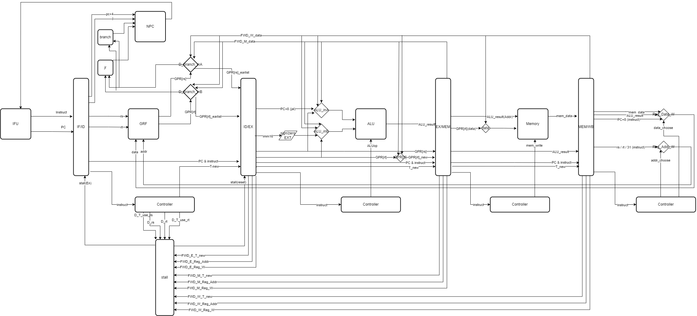

# 计算机组成 P5 - Verilog Pipeline CPU

::github{repo="Alkaid-Zhong/BUAA-CO-2023"}

## Supported Instruction Set

|       format       |  instructs  |
| :----------------: | :---------: |
|      `cal_r`       | `add`,`sub` |
|      `cal_i`       | `ori`,`lui` |
|      `branch`      |    `beq`    |
|       `load`       |    `lw`     |
|      `store`       |    `sw`     |
|  `jump to index`   |    `jal`    |
| `jump to register` |    `jr`     |
|       `link`       |    `jal`    |
|    `read HI/LO`    |             |
|   `write HI/LO`    |             |
|       `nop`        |    `nop`    |

## Data Path



## Controller

<table style="text-align:center; font-size:10px">
    <tr>
        <th>op</th>
        <th colspan="4">Regitser</th>
        <th colspan="4">ALU</th>
        <th>Memory</th>
        <th colspan="3">PC</th>
    </tr>
    <tr>
        <td style="font-weight: bold;"></td>
        <td>RegW2rd</td>
        <td>Mem2Reg</td>
        <td>link</td>
        <td>RegWrite</td>
        <td>ALUuseImm</td>
        <td>immSignExt</td>
        <td>ALUctrl</td>
        <td>saveHigh</td>
        <td>MemWrite</td>
        <td>Branch</td>
        <td>jIndex</td>
        <td>jr</td>
    </tr>>
    <tr>
        <td style="font-weight: bold;">add</td>
        <td>&#10004</td>
        <td></td>
        <td></td>
        <td>&#10004</td>
        <td></td>
        <td></td>
        <td style="font-weight: bold;">add</td>
        <td></td>
        <td></td>
        <td></td>
        <td></td>
        <td></td>
    </tr>
    <tr>
        <td style="font-weight: bold;">sub</td>
        <td>&#10004</td>
        <td></td>
        <td></td>
        <td>&#10004</td>
        <td></td>
        <td></td>
        <td style="font-weight: bold;">sub</td>
        <td></td>
        <td></td>
        <td></td>
        <td></td>
        <td></td>
    </tr>
    <tr>
        <td style="font-weight: bold;">ori</td><!--op-->
        <td></td><!--RegW2rd-->
        <td></td><!--Mem2Reg-->
        <td></td><!--link-->
        <td>&#10004</td><!--RegWrite-->
        <td>&#10004</td><!--ALUuseImm-->
        <td></td><!--immSignExt-->
        <td style="font-weight: bold;">or</td><!--ALUctrl-->
        <td></td><!--saveHigh-->
        <td></td><!--MemWrite-->
        <td></td><!--Branch-->
        <td></td><!--jIndex-->
        <td></td><!--jr-->
    </tr>
    <tr>
        <td style="font-weight: bold;">lw</td><!--op-->
        <td></td><!--RegW2rd-->
        <td>&#10004</td><!--Mem2Reg-->
        <td></td><!--link-->
        <td>&#10004</td><!--RegWrite-->
        <td>&#10004</td><!--ALUuseImm-->
        <td>&#10004</td><!--immSignExt-->
        <td style="font-weight: bold;">add</td><!--ALUctrl-->
        <td></td><!--saveHigh-->
        <td></td><!--MemWrite-->
        <td></td><!--Branch-->
        <td></td><!--jIndex-->
        <td></td><!--jr-->
    </tr>
    <tr>
        <td style="font-weight: bold;">sw</td><!--op-->
        <td></td><!--RegW2rd-->
        <td></td><!--Mem2Reg-->
        <td></td><!--link-->
        <td></td><!--RegWrite-->
        <td>&#10004</td><!--ALUuseImm-->
        <td>&#10004</td><!--immSignExt-->
        <td style="font-weight: bold;">add</td><!--ALUctrl-->
        <td></td><!--saveHigh-->
        <td>&#10004</td><!--MemWrite-->
        <td></td><!--Branch-->
        <td></td><!--jIndex-->
        <td></td><!--jr-->
    </tr>
    <tr>
        <td style="font-weight: bold;">beq</td><!--op-->
        <td></td><!--RegW2rd-->
        <td></td><!--Mem2Reg-->
        <td></td><!--link-->
        <td></td><!--RegWrite-->
        <td></td><!--ALUuseImm-->
        <td></td><!--immSignExt-->
        <td style="font-weight: bold;">sub</td><!--ALUctrl-->
        <td></td><!--saveHigh-->
        <td></td><!--MemWrite-->
        <td>&#10004</td><!--Branch-->
        <td></td><!--jIndex-->
        <td></td><!--jr-->
    </tr>
    <tr>
        <td style="font-weight: bold;">lui</td><!--op-->
        <td></td><!--RegW2rd-->
        <td></td><!--Mem2Reg-->
        <td></td><!--link-->
        <td>&#10004</td><!--RegWrite-->
        <td>&#10004</td><!--ALUuseImm-->
        <td></td><!--immSignExt-->
        <td style="font-weight: bold;">or</td><!--ALUctrl-->
        <td>&#10004</td><!--saveHigh-->
        <td></td><!--MemWrite-->
        <td></td><!--Branch-->
        <td></td><!--jIndex-->
        <td></td><!--jr-->
    </tr>
    <tr>
        <td style="font-weight: bold;">jal</td><!--op-->
        <td></td><!--RegW2rd-->
        <td></td><!--Mem2Reg-->
        <td>&#10004</td><!--link-->
        <td>&#10004</td><!--RegWrite-->
        <td></td><!--ALUuseImm-->
        <td></td><!--immSignExt-->
        <td style="font-weight: bold;">nop</td><!--ALUctrl-->
        <td></td><!--saveHigh-->
        <td></td><!--MemWrite-->
        <td></td><!--Branch-->
        <td>&#10004</td><!--jIndex-->
        <td></td><!--jr-->
    </tr>
    <tr>
        <td style="font-weight: bold;">jr</td><!--op-->
        <td></td><!--RegW2rd-->
        <td></td><!--Mem2Reg-->
        <td></td><!--link-->
        <td></td><!--RegWrite-->
        <td></td><!--ALUuseImm-->
        <td></td><!--immSignExt-->
        <td style="font-weight: bold;">nop</td><!--ALUctrl-->
        <td></td><!--saveHigh-->
        <td></td><!--MemWrite-->
        <td></td><!--Branch-->
        <td></td><!--jIndex-->
        <td>&#10004</td><!--jr-->
    </tr>
    <tr>
        <td style="font-weight: bold;"></td><!--op-->
        <td></td><!--RegW2rd-->
        <td></td><!--Mem2Reg-->
        <td></td><!--link-->
        <td></td><!--RegWrite-->
        <td></td><!--ALUuseImm-->
        <td></td><!--immSignExt-->
        <td style="font-weight: bold;"></td><!--ALUctrl-->
        <td></td><!--saveHigh-->
        <td></td><!--MemWrite-->
        <td></td><!--Branch-->
        <td></td><!--jIndex-->
        <td></td><!--jr-->
    </tr>
</table>

|  op   |    Write_Enable    | T_new | T_use_rs | T_use_rt |
| :---: | :----------------: | :---: | :------: | :------: |
| `add` | :white_check_mark: |   2   |    1     |    1     |
| `sub` | :white_check_mark: |   2   |    1     |    1     |
| `ori` | :white_check_mark: |   2   |    1     |   _5_    |
| `lw`  | :white_check_mark: |   3   |    1     |   _5_    |
| `sw`  |                    |       |    1     |    2     |
| `beq` |                    |       |    0     |    0     |
| `lui` | :white_check_mark: |   2   |    1     |   _5_    |
| `jal` | :white_check_mark: |   2   |   _5_    |   _5_    |
| `jr`  |                    |       |    0     |   _5_    |

## Pipeline Register

| Pipeline Register |            |      |           |           |              |            |         |
| :---------------: | :--------: | :--: | :-------: | :-------: | :----------: | :--------: | :-----: |
|       IF/ID       | `instruct` | `PC` |           |           |              |            |         |
|       ID/EX       | `instruct` | `PC` | `GPR[rs]` | `GPR[rt]` |              |            | `T_new` |
|      EX/MEM       | `instruct` | `PC` |           | `GPR[rt]` | `ALU_result` |            | `T_new` |
|      MEM/WB       | `instruct` | `PC` |           |           | `ALU_result` | `Mem_data` | `T_new` |

## Stall

```verilog
if     (D_rs == FWD_E_Reg_Addr && D_T_use_rs < FWD_E_T_new && FWD_E_Reg_W)
    stall <= 1'b1;
else if(D_rt == FWD_E_Reg_Addr && D_T_use_rt < FWD_E_T_new && FWD_E_Reg_W)
    stall <= 1'b1;
else if(D_rs == FWD_M_Reg_Addr && D_T_use_rs < FWD_M_T_new && FWD_M_Reg_W)
    stall <= 1'b1;
else if(D_rt == FWD_M_Reg_Addr && D_T_use_rt < FWD_M_T_new && FWD_M_Reg_W)
    stall <= 1'b1;
else if(D_rs == FWD_W_Reg_Addr && D_T_use_rs < FWD_W_T_new && FWD_W_Reg_W)
    stall <= 1'b1;
else if(D_rt == FWD_W_Reg_Addr && D_T_use_rt < FWD_W_T_new && FWD_W_Reg_W)
    stall <= 1'b1;
else
    stall <= 1'b0;
```

## Forward Data

### EX/MEM

`FWD_Data = ALU_result`

### MEM/WB

`FWD_Data = MemData / ALU_result / PC + 8`

### GRF

`DataR = ((AddrR == AddrW && WEn) ? DataW : register[AddrR])`

## _special_

```verilog
//in ALU
if(instruct == jal)
	ALU_result <= PC + 8
```

## 思考题

1. 我们使用提前分支判断的方法尽早产生结果来减少因不确定而带来的开销，但实际上这种方法并非总能提高效率，请从流水线冒险的角度思考其原因并给出一个指令序列的例子。

   ```
   lw $1, 0($0)
   beq $1, $2, lable
   ```

   这两条指令连续执行的时候，`beq`还是需要等待`lw`两周期

2. 因为延迟槽的存在，对于 `jal` 等需要将指令地址写入寄存器的指令，要写回 PC + 8，请思考为什么这样设计？

   A：因为当D级运行到`jal`时，下一个时钟上升沿到来，`PC <= index`，同时`IF/ID`寄存器存入`jal`的下一条指令，在之后执行`jr`的时候，由于`PC + 4`的指令已经被执行过，因此无须再次执行，因此写回`PC + 8`可以避免重复执行延迟槽的指令

3. 我们要求大家所有转发数据都来源于流水寄存器而不能是功能部件（如 DM 、 ALU ），请思考为什么？

   功能部件的执行时间可能会受到多种因素的影响，如数据的读取速度、指令的复杂程度等。如果直接从功能部件中获取数据，可能会导致数据的延迟，从而影响流水线的性能。因此，为了保证流水线的正常运行，我们要求所有转发数据都来源于流水寄存器，而不能是功能部件。这样可以保证数据的传递速度和流水线的性能。

4. 我们为什么要使用 GPR 内部转发？该如何实现？

   因为当D级的指令读取寄存器数据的时候，若该地址的寄存器于WB阶段正在被写回，若不采用内部转发，则读取到的数据就会是旧的数据，若采用暂停，则会影响性能。

   ```verilog
   assign DataR1 = ((AddrR1 == AddrW && WEn) ? DataW : register[AddrR1]);
   assign DataR2 = ((AddrR2 == AddrW && WEn) ? DataW : register[AddrR2]);
   ```

5. 我们转发时数据的需求者和供给者可能来源于哪些位置？共有哪些转发数据通路？

   供给者：`EX/MEM`或`MEM/WB`寄存器

   需求者：D级分支比较，D级`jr`，E级ALU，M级Memory_Write

   转发通路：`EM/MEM`到D级分支比较，`EM/MEM`到D级`jr`，`EM/MEM`到E级ALU，`MEM/WB`到D级分支比较，`MEM/WB`到D级`jr`，`MEM/WB`到E级ALU，`MEM/WB`到M级Memory_Write

6. 在课上测试时，我们需要你现场实现新的指令，对于这些新的指令，你可能需要在原有的数据通路上做哪些扩展或修改？提示：你可以对指令进行分类，思考每一类指令可能修改或扩展哪些位置。

   主要需要修改的地方应该是Controller对各个信号的控制，以及新数据的Tuse和Tnew

7. 确定你的译码方式，简要描述你的译码器架构，并思考该架构的优势以及不足。

   分布式译码

   架构是在每一级根据该级的指令单独译码出该级需要的指令，好处流水器寄存器只需要保存该级的指令，不需要保存信号，坏处是要实例化很多译码器