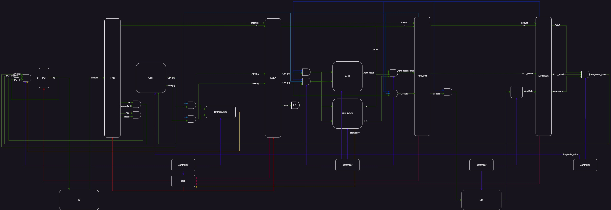

# 计算机组成 P6 - Verilog Pipeline CPU

::github{repo="Alkaid-Zhong/BUAA-CO-2023"}

## Supported Instruction Set

|    format     |              instructs              |      RegWrite      | DataFrom | RegDst | Tnew  | Tuse_rs | Tuse_rt |
| :-----------: | :---------------------------------: | :----------------: | :------: | :----: | :---: | :-----: | :-----: |
|    `cal_r`    | `add`,`sub`,`and`,`or`,`slt`,`sltu` | :white_check_mark: |  `ALU`   |  `rd`  | **2** |  **1**  |  **1**  |
|    `cal_i`    |      `ori`,`lui`,`addi`,`andi`      | :white_check_mark: |  `ALU`   |  `rt`  | **2** |  **1**  |         |
|   `branch`    |             `beq`,`bne`             |                    |          |        |       |  **0**  |  **0**  |
|    `load`     |           `lw`,`lh`,`lb`            | :white_check_mark: | `Memory` |  `rt`  | **3** |  **1**  |         |
|    `store`    |           `sw`,`sh`,`sb`            |                    |          |        |       |  **1**  |         |
|   `j index`   |                `jal`                |                    |          |        |       |         |         |
| `j register`  |                `jr`                 |                    |          |        |       |  **0**  |         |
|    `link`     |                `jal`                | :white_check_mark: |  `PC+8`  |  `31`  | **2** |         |         |
| `read HI/LO`  |            `mfhi`,`mflo`            | :white_check_mark: |  `ALU`   |  `rd`  | **2** |         |         |
| `write HI&LO` |     `mult`,`multu`,`div`,`divu`     |                    |          |        |       |  **1**  |  **1**  |
| `write HI/LO` |            `mthi`,`mtlo`            |                    |          |        |       |  **1**  |         |
|     `nop`     |                `nop`                |                    |          |        |       |         |         |

## Data Path



## Controller

|           instruct            | ALU control |    inB use imm     |  imm sign extend   |
| :---------------------------: | :---------: | :----------------: | :----------------: |
|             `add`             |    `add`    |                    |                    |
|          `sub`,`beq`          |    `sub`    |                    |                    |
|             `and`             |    `and`    |                    |                    |
|             `or`              |    `or`     |                    |                    |
|             `slt`             |    `slt`    |                    |                    |
|            `sltu`             |   `sltu`    |                    |                    |
|             `bne`             |    `bne`    |                    |                    |
|          `lui`,`ori`          |    `or`     | :white_check_mark: |                    |
|            `addi`             |    `add`    | :white_check_mark: | :white_check_mark: |
|            `andi`             |    `and`    | :white_check_mark: |                    |
| `lb`,`lh`,`lw`,`sb`,`sh`,`sw` |    `sub`    | :white_check_mark: | :white_check_mark: |

## Pipeline Register

| Pipeline Register |            |      |           |           |              |            |         |
| :---------------: | :--------: | :--: | :-------: | :-------: | :----------: | :--------: | :-----: |
|       IF/ID       | `instruct` | `PC` |           |           |              |            |         |
|       ID/EX       | `instruct` | `PC` | `GPR[rs]` | `GPR[rt]` |              |            | `T_new` |
|      EX/MEM       | `instruct` | `PC` |           | `GPR[rt]` | `ALU_result` |            | `T_new` |
|      MEM/WB       | `instruct` | `PC` |           |           | `ALU_result` | `Mem_data` | `T_new` |

## Stall

```verilog
if     (D_rs == FWD_E_Reg_Addr && D_T_use_rs < FWD_E_T_new && FWD_E_Reg_W)
    stall <= 1'b1;
else if(D_rt == FWD_E_Reg_Addr && D_T_use_rt < FWD_E_T_new && FWD_E_Reg_W)
    stall <= 1'b1;
else if(D_rs == FWD_M_Reg_Addr && D_T_use_rs < FWD_M_T_new && FWD_M_Reg_W)
    stall <= 1'b1;
else if(D_rt == FWD_M_Reg_Addr && D_T_use_rt < FWD_M_T_new && FWD_M_Reg_W)
    stall <= 1'b1;
else if(D_rs == FWD_W_Reg_Addr && D_T_use_rs < FWD_W_T_new && FWD_W_Reg_W)
    stall <= 1'b1;
else if(D_rt == FWD_W_Reg_Addr && D_T_use_rt < FWD_W_T_new && FWD_W_Reg_W)
    stall <= 1'b1;
else if(D_MULT_DIV && (E_ctrl_MULT_DIV_start || E_MULT_DIV_busy))
    stall <= 1'b1;
else
    stall <= 1'b0;
```

## Forward Data

### EX/MEM

`FWD_Data = ALU_result / PC + 8 / HI / LO`

### MEM/WB

`FWD_Data = MemData / ALU_result / PC + 8`

### GRF

`DataR = ((AddrR == AddrW && WEn) ? DataW : register[AddrR])`

## _special_

```verilog
//in M_FWD
if(E_ctrl_link31) begin
    E_ALU_result_final <= E_PC + 32'h0000_0008;
end
else if(E_ctrl_MULT_DIV_mfhi) begin
    E_ALU_result_final <= E_MULT_DIV_HI;
end
else if(E_ctrl_MULT_DIV_mflo) begin
    E_ALU_result_final <= E_MULT_DIV_LO;
end
else begin
    E_ALU_result_final <= E_ALU_result;
end
```

## 思考题

1. 为什么需要有单独的乘除法部件而不是整合进 ALU？为何需要有独立的 HI、LO 寄存器？

   因为乘除法的效率比ALU其他运输运算的效率要低很多，不单独设计的话会极大降低频率，让CPU整体效率降低，使用单独的HI，LO寄存器是因为乘除法需要两个寄存器来保存结果，和其他指令需要一个不一样。

2. 真实的流水线 CPU 是如何使用实现乘除法的？请查阅相关资料进行简单说明。

   在真实的流水线 CPU 中，乘法通常有若干个较小的乘法单元组成（组合逻辑），然后每个周期计算特定的几位，依次累加起来，于是会在几个周期后得到正确的最终结果；除法通常使用试商法，通常也是使用组合逻辑在一个周期内计算 4 位左右的商，经过 8 个周期正好可以计算结束。

3. 请结合自己的实现分析，你是如何处理 Busy 信号带来的周期阻塞的？

   当`Busy`或`Start`信号为`1`并且D级为乘除法指令的时候阻塞

   ```verilog
   if(D_MULT_DIV && (E_ctrl_MULT_DIV_start || E_MULT_DIV_busy))
       stall <= 1'b1;
   ```

4. 请问采用字节使能信号的方式处理写指令有什么好处？（提示：从清晰性、统一性等角度考虑）

   可以在`sh`、`sb`的时候只需要传入数据和使能信号，不需要在顶层操控DM的具体行为，实现高内聚、低耦合

5. 请思考，我们在按字节读和按字节写时，实际从 DM 获得的数据和向 DM 写入的数据是否是一字节？在什么情况下我们按字节读和按字节写的效率会高于按字读和按字写呢？

   不是，实际上是4字节。在需要按字节写入的时候会高于按字写入。

6. 为了对抗复杂性你采取了哪些抽象和规范手段？这些手段在译码和处理数据冲突的时候有什么样的特点与帮助？

   按照`cal_r`,`cal_i`,`load`,`store`,`mult/div`,`branch`,`jump`来分类指令，这样可以将同类型的指令在生成控制信号的时候统一处理。

7. 在本实验中你遇到了哪些不同指令类型组合产生的冲突？你又是如何解决的？相应的测试样例是什么样的？

   ```
   mult $1, $2
   mfhi $3
   mflo $4
   ```

   新增的指令会在乘除法开始后直接进行`mflo`和`mfhi`时阻塞，其他与P5相同

8. 如果你是手动构造的样例，请说明构造策略，说明你的测试程序如何保证**覆盖**了所有需要测试的情况；如果你是**完全随机**生成的测试样例，请思考完全随机的测试程序有何不足之处；如果你在生成测试样例时采用了**特殊的策略**，比如构造连续数据冒险序列，请你描述一下你使用的策略如何**结合了随机性**达到强测的效果。

   在手动构造数据的时候，在P5的基础上，加入连续操作乘除法的指令，并且在乘除法之间的5-10周期内加入其他指令，来检测新增的指令是否有错误。