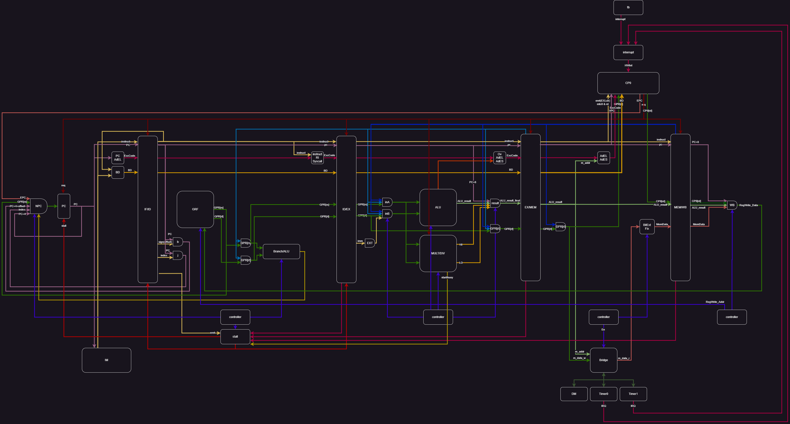

# 计算机组成 P7 - Verilog Pipeline CPU

::github{repo="Alkaid-Zhong/BUAA-CO-2023"}

## Supported Instruction Set

|    format     |              instructs              |      RegWrite      | DataFrom  | RegDst | Tnew  | Tuse_rs | Tuse_rt |
| :-----------: | :---------------------------------: | :----------------: | :-------: | :----: | :---: | :-----: | :-----: |
|    `cal_r`    | `add`,`sub`,`and`,`or`,`slt`,`sltu` | :white_check_mark: |   `ALU`   |  `rd`  | **2** |  **1**  |  **1**  |
|    `cal_i`    |      `ori`,`lui`,`addi`,`andi`      | :white_check_mark: |   `ALU`   |  `rt`  | **2** |  **1**  |         |
|   `branch`    |             `beq`,`bne`             |                    |           |        |       |  **0**  |  **0**  |
|    `load`     |           `lw`,`lh`,`lb`            | :white_check_mark: | `Memory`  |  `rt`  | **3** |  **1**  |         |
|    `store`    |           `sw`,`sh`,`sb`            |                    |           |        |       |  **1**  |         |
|   `j index`   |                `jal`                |                    |           |        |       |         |         |
| `j register`  |                `jr`                 |                    |           |        |       |  **0**  |         |
|    `link`     |                `jal`                | :white_check_mark: |  `PC+8`   |  `31`  | **2** |         |         |
| `read HI/LO`  |            `mfhi`,`mflo`            | :white_check_mark: |   `ALU`   |  `rd`  | **2** |         |         |
| `write HI&LO` |     `mult`,`multu`,`div`,`divu`     |                    |           |        |       |  **1**  |  **1**  |
| `write HI/LO` |            `mthi`,`mtlo`            |                    |           |        |       |  **1**  |         |
|     `nop`     |                `nop`                |                    |           |        |       |         |         |
|    `mfc0`     |               `mfc0`                | :white_check_mark: | `CP0[rd]` |  `rt`  | **3** |         |         |
|    `mtc0`     |               `mtc0`                |   **`CP0[rd]`**    | `GPR[rt]` |        |       |         |  **2**  |
|    `eret`     |               `eret`                |                    |           |        |       |         |         |
|   `syscall`   |              `syscall`              |                    |           |        |       |         |         |

## Data Path



## Controller

|           instruct            | ALU control |    inB use imm     |  imm sign extend   |
| :---------------------------: | :---------: | :----------------: | :----------------: |
|             `add`             |    `add`    |                    |                    |
|          `sub`,`beq`          |    `sub`    |                    |                    |
|             `and`             |    `and`    |                    |                    |
|             `or`              |    `or`     |                    |                    |
|             `slt`             |    `slt`    |                    |                    |
|            `sltu`             |   `sltu`    |                    |                    |
|             `bne`             |    `bne`    |                    |                    |
|          `lui`,`ori`          |    `or`     | :white_check_mark: |                    |
|            `addi`             |    `add`    | :white_check_mark: | :white_check_mark: |
|            `andi`             |    `and`    | :white_check_mark: |                    |
| `lb`,`lh`,`lw`,`sb`,`sh`,`sw` |    `sub`    | :white_check_mark: | :white_check_mark: |

## Pipeline Register

| Pipeline Register |            |      |           |           |              |            |         |           |      |       |
| :---------------- | :--------: | :--: | :-------: | :-------: | :----------: | :--------: | :-----: | :-------: | :--: | :---: |
| `IF/ID`           | `instruct` | `PC` |           |           |              |            |         | `ExcCode` | `BD` |       |
| `ID/EX`           | `instruct` | `PC` | `GPR[rs]` | `GPR[rt]` |              |            | `T_new` | `ExcCode` | `BD` |       |
| `EX/MEM`          | `instruct` | `PC` |           | `GPR[rt]` | `ALU_result` |            | `T_new` | `ExcCode` | `BD` |       |
| `MEM/WB`          | `instruct` | `PC` |           |           | `ALU_result` | `Mem_data` | `T_new` |           |      | `CP0` |

### Priority Level

`reset > ReqClr > clr > en`

## PC

### Priority Level

`reset > req > en`

## Stall

```verilog
if (D_eret && (E_mtc0 || M_mtc0))
    stall = 1'b1;
else if (D_rs == FWD_E_Reg_Addr && D_T_use_rs < FWD_E_T_new && FWD_E_Reg_WriteEn)
    stall = 1'b1;
else if(D_rt == FWD_E_Reg_Addr && D_T_use_rt < FWD_E_T_new && FWD_E_Reg_WriteEn)
    stall = 1'b1;
else if(D_rs == FWD_M_Reg_Addr && D_T_use_rs < FWD_M_T_new && FWD_M_Reg_WriteEn)
    stall = 1'b1;
else if(D_rt == FWD_M_Reg_Addr && D_T_use_rt < FWD_M_T_new && FWD_M_Reg_WriteEn)
    stall = 1'b1;
else if(D_rs == FWD_W_Reg_Addr && D_T_use_rs < FWD_W_T_new && FWD_W_Reg_WriteEn)
    stall = 1'b1;
else if(D_rt == FWD_W_Reg_Addr && D_T_use_rt < FWD_W_T_new && FWD_W_Reg_WriteEn)
    stall = 1'b1;
else if(D_MULT_DIV && (E_ctrl_MULT_DIV_start || E_MULT_DIV_busy))
    stall = 1'b1;
else
    stall = 1'b0;
```

## Forward Data

### EX/MEM

`FWD_Data = ALU_result / PC + 8 / HI / LO`

### MEM/WB

`FWD_Data = MemData / ALU_result / PC + 8 / CP0`

### GRF

`DataR = ((AddrR == AddrW && WEn) ? DataW : register[AddrR])`

## _special_

```verilog
//in M_FWD
if(E_ctrl_link31) begin
    E_ALU_result_final = E_PC + 32'h0000_0008;
end
else if(E_ctrl_MULT_DIV_mfhi) begin
    E_ALU_result_final = E_MULT_DIV_HI;
end
else if(E_ctrl_MULT_DIV_mflo) begin
    E_ALU_result_final = E_MULT_DIV_LO;
end
else begin
    E_ALU_result_final = E_ALU_result;
end
```

## Bridge

Receive data from `DM / TC0 / TC1`

```verilog
assign addr_final = addr;
assign data_w_final = data_w;
assign data_r_final = (32'h0000_0000 <= addr && addr <= 32'h0000_2fff) ? DM_data_r :
                      (32'h0000_7f00 <= addr && addr <= 32'h0000_7f0b) ? Timer0_data_r :
                      (32'h0000_7f10 <= addr && addr <= 32'h0000_7f1b) ? Timer1_data_r :
                      32'h0000_0000;
assign DM_byteen = (32'h0000_0000 <= addr && addr <= 32'h0000_2fff) ? byteen : 4'b0000;
assign Timer0_WriteEn = (32'h0000_7f00 <= addr && addr <= 32'h0000_7f0b) ? (&byteen) : 1'b0;
assign Timer1_WriteEn = (32'h0000_7f10 <= addr && addr <= 32'h0000_7f1b) ? (&byteen) : 1'b0;
```

## CP0

**宏观PC: M级PC**

| num  |  name   |             |             |                | mode  |
| :--: | :-----: | :---------: | :---------: | :------------: | :---: |
| `12` |  `SR`   | `IM[15:10]` |  `EXL[1]`   |    `IE[0]`     | `R/W` |
| `13` | `Cause` |  `BD[31]`   | `IP[15:10]` | `ExcCode[6:2]` |  `R`  |
| `14` |  `EPC`  |             |             |                | `R/W` |

```verilog
`Cause[`IP] <= HWInt;
if(Req) begin
    `SR[`EXL] <= 1'b1;
    `EPC <= BD_in ? (VPC - 32'h4) : VPC;
    `Cause[`ExcCode] <= Req_interrupt ? 5'b00000 : ExcCode_in;
    `Cause[`BD] <= BD_in;
end
else if(en) begin
    if(CP0_Addr == 5'd12) begin
        `SR[`IM] <= CP0_in[`IM];
        `SR[`EXL] <= CP0_in[`EXL];
        `SR[`IE] <= CP0_in[`IE];
    end
    else if(CP0_Addr == 5'd14) begin
        `EPC <= CP0_in;
    end
end
else if(EXL_clr) begin
    `SR[`EXL] <= 1'b0;
end
```

### Exception


## 思考题

1. 请查阅相关资料，说明鼠标和键盘的输入信号是如何被 CPU 知晓的？

   键盘、鼠标这类的低速设备是通过中断请求的方式进行IO操作的。即当键盘上按下一个按键的时候，键盘会发出一个中断信号，中断信号经过中断控制器传到CPU，然后CPU根据不同的中断号执行不同的中断响应程序，然后进行相应的IO操作，把按下的按键编码读到寄存器（或者鼠标的操作），最后放入内存中。

2. 请思考为什么我们的 CPU 处理中断异常必须是已经指定好的地址？如果你的 CPU 支持用户自定义入口地址，即处理中断异常的程序由用户提供，其还能提供我们所希望的功能吗？如果可以，请说明这样可能会出现什么问题？否则举例说明。（假设用户提供的中断处理程序合法）

   我认为处理中断异常可以是用户自己定的地址。实现的时候可以定义一个存储异常入口的寄存器，这样就可以在跳转的时候直接从该寄存器取址，并跳转到指定的程序。但是我觉得换程序入口意义不大，因为不同的程序肯定是为了处理不同的异常，但是判断异常类型直接从`cause`中就可以，然后跳转到异常处理程序的不同函数区间就可以。没有必要每次都改程序入口，浪费一条指令。

3. 为何与外设通信需要 Bridge？

   因为如果在CPU中处理很多的外设就需要额外在顶层写许多信号，非常麻烦。但是使用`Bridge`可以让CPU只需要处理数据即可，不需要关心数据来源，达到低耦合，高内聚。

4. 请阅读官方提供的定时器源代码，阐述两种中断模式的异同，并分别针对每一种模式绘制状态移图。

   

5. 倘若中断信号流入的时候，在检测宏观 PC 的一级如果是一条空泡（你的 CPU 该级所有信息均为空）指令，此时会发生什么问题？在此例基础上请思考：在 P7 中，清空流水线产生的空泡指令应该保留原指令的哪些信息？

   宏观PC会突然变成0

   应该保留PC

6. 为什么 `jalr` 指令为什么不能写成 `jalr $31, $31`？

   如果`jalr`延迟槽中指令发生异常，或者中断，这时候`jalr`已经流水到W级，在下个周期已经完成写回，那在`eret`恢复的时候没办法重新执行，因为`$31`已经被改变。
